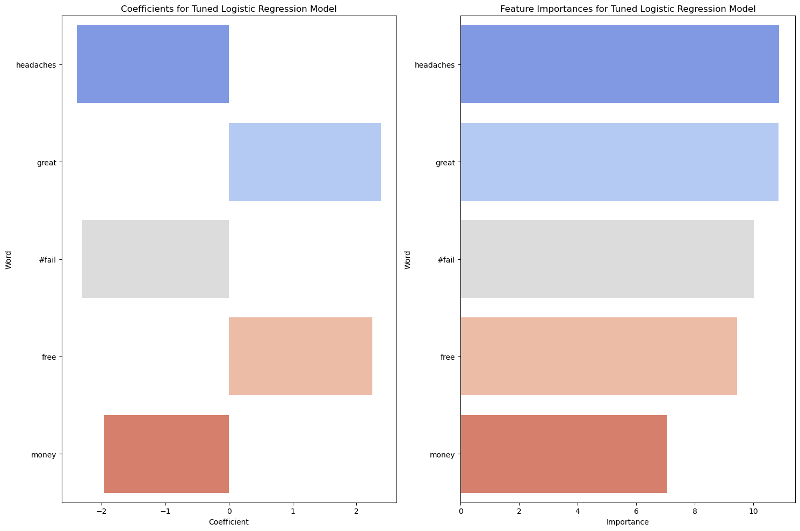

# Phase-4-Project

# INTRODUCTION

The project revolves around evaluating tweets pertaining to various brands and products, where contributors were tasked with determining whether the tweets conveyed positive, negative, or neutral emotions towards the mentioned brand or product. Additionally, if emotion was expressed, contributors specified the target brand or product. Leveraging Natural Language Processing (NLP), the objective is to construct a model capable of analyzing sentiment in tweets related to Apple and Google products.

## Project Overview

The project aims to develop a model capable of accurately determining the sentiment conveyed in tweets by analyzing their content.

## Key Stakeholders

Key stakeholders who will benefit from this project include:

1. Businesses: Companies such as Apple and Google.

2. Marketers and Analysts.

3. Social Media Managers.

4. Data Scientists and Researchers.

5. Consumers.

## Business Problem

The primary business problem addressed by the project is the lack of real-time insights into public sentiment towards brands and products. This deficiency hampers informed decision-making in marketing strategies, product development, and customer relationship management efforts.

## Objectives

1. Sentiment Analysis:
   - Analyze tweets to discern positive, negative, or neutral sentiments towards brands and products.

2. Insight Generation:
   - Identify trends, patterns, and prevalent topics in tweets to understand public sentiment on brands and products.

3. Recommendations:
   - Offer actionable suggestions for businesses derived from sentiment analysis to enhance brand image, address concerns, and engage with the audience effectively.

## Data Exploration and Pre-processing

We begin by loading the dataset into a DataFrame and thoroughly examining its structure and contents, identifying available columns and potential sentiment labels. After checking for missing values and inconsistencies, we explore the distribution of sentiment labels and tweet counts across brands or products.

Moving to data preprocessing, we address missing values, remove duplicates, and clean text data by eliminating special characters, punctuation, and stopwords.Additionally, we standardize text data by converting it to lowercase, ensuring uniformity for subsequent analyses. These steps prepare the dataset for sentiment analysis and insights extraction with enhanced clarity and reliability.

## Modeling

In our project, we employed Natural Language Processing (NLP) to analyze tweets and gauge public sentiment toward Apple and Google products. Our system was designed to discern whether tweets conveyed positive, negative, or neutral feelings. Through our findings, we aim to provide insights into public opinions about these products based on Twitter discussions.

After modeling, here are the top five mentioned features.

# CONCLUSIONS & RECOMMENDATIONS

## Conclusions
 

Today, it is more important than ever for businesses to be in tune with their customers. "Listening" to the public opinion on their products and services not only allows for them to maintain financial success, but also provides them with opportunities to stay competitive in the market. Both Google and Apple can leverage the models we developed to monitor the sentiment of their events and products via social media platforms. This would also allow them to stay on top of what people are saying about their competitors and may give them a competitive advantage.

Our ultimate model effectively analyzed the tweets, enabling us to generate the following recommendations.

Our analysis of the tweets for the SXSW Conference showed the following:

**1. How is Apple perceived as a company during the SXSW Conference, and how does this compare to Google as one of their main competitors?**

- During the SXSW Conference, 81.1% of all tweets related to Apple were positive compared to Google's 82%.
- During the SXSW Conference, 16.1% of all tweets related to Apple were negative compared to Google's 14.9%

This suggests that both companies and their products and services are perceived mostly in a positive way. 

**2. How are Apple and Google's products and announcements perceived during the SXSW Conference? Are there specific pain points within the products that Apple should address?**

Apple - Positives:
- Tweets about Apple suggest that the temporary pop-up store announcement in downtown Austin has been received very well by Apple fans and generated a lot of excitement for the brand. 
- One of the most frequently talked about products was the iPad 2 which seems to have been launched during SXSW and sold in the Austin temporary pop-up store. Based on the tweets, Apple's launch of this product definitely generated a lot of buzz.
- Samplers and free products/services were frequently mentioned as well.

Apple - Negatives:
- The iPhone's battery is frequently discussed in negative tweets.
- Design of the iPad was referred to as a "design headache."
- There are several tweets mentioning Kara Swisher and references to Apple as a "fascist company."
- Several apps are referred to as "battery killer" and the design of the News app seems to have not been received positively.

Google - Positives:
- Google's party in Lustre Pearl generated a lot of buzz.
- Marissa Mayer is mentioned extensively, so her talk was positively received.
- Google's new social network project "Circle" seems to have caused a lot of excitement.
- Microsoft's Bing search engine is mentioned in a negative way.

Google - Negatives:
- Some users seem to be having issues with Android OS based on words such as "buggy", "replaced", and "painful."
- Samsung is mentioned in tweets with relation to Android suggesting some users may prefer it to Google's products.
- Users of Meetup are having problems with Android.

## Recommendations

### Recommendations for Apple:

    1. Enhance iPhone Battery Life: Mitigate negative sentiment by improving battery performance.
    2. Revise iPad Design: Address user feedback to refine design elements.
    3. Optimize Product Launches: Utilize pop-up stores and event launches for increased brand excitement and engagement.

### Recommendations for Google:

    1. Resolve Android OS Issues: Investigate and resolve reported bugs to enhance user satisfaction.
    2. Enhance Google Products: Prioritize innovation and user-friendly features to remain competitive.
    3. Optimize Customer Support: Improve assistance for Android OS and Google product users.

## Necessary Links

Jupyter [Notebook](nlp_tweets_notebook.ipynb)

 [Presentation](<GROUP 9.pdf>)

# Phase-4-Project
